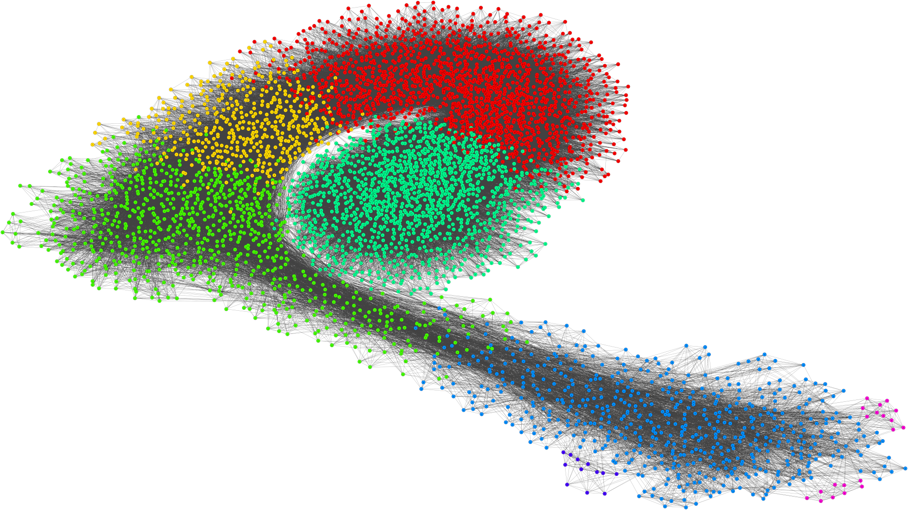

# Community detection

# Algorithms
* Girvan-Newman
* Label Propagation Algorithm
* Overlapping Community Detection by Local Communities Expantions
* Louvain Alogirhtm

# Project structure
* /Implementation - main section of the project, contains all implementations and common files
* /Data - files containing datasets
* /Documentation - initial and final documentation
* /Scrapers - implementation of NBA, Filmweb and Github scrapers
* /Results - some results from algorithms runs, mainly in svg

# Technology stack
* Graph manipulation - python-igraph
* Editor and environment - jupyter notebook
* Parallel implementation - C++ CUDA
* Report - LaTEX

# Notes
* As it was university course the report is written in polish
